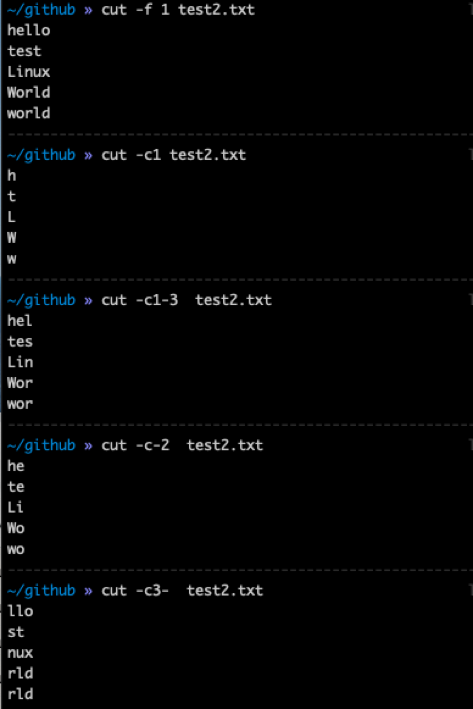

# cut & paste & tr 命令学习
### cut 命令
* cut命令用来显示行中的指定部分，每行从开头算起num1到num2的文字
* 用法
  * ```cut [option] ```
* 参数
  * ```-b``` ：仅显示行中指定直接范围的内容；
  * ```-c``` ：仅显示行中指定范围的字符；
  * ```-d``` ：指定字段的分隔符，默认的字段分隔符为“TAB”；
  * ```-f``` ：显示指定字段的内容；
  * ```-n``` ：与“-b”选项连用，不分割多字节字符；
* 示例：
  * ```cut -c1-3  test2.txt``` : 显示文件中 1到3 列字符
  * ```cut -c-2  test2.txt```  : 打印前两个字符
  * ``` cut -c3-  test2.txt``` : 从第3个字符开始显示
* 练习
    

### paste
* paste用于文件合并,合并文件的列
* 用法
  * ```paste [-s] [-d delimiters] file ...``` 
* 示例：
  * ```paste -s test2.txt``` : 合并文件的多行数据
  * ```paste test.txt test2.txt``` : 合并两个文件，以列合并
* 练习
    

### tr
* 用与转换/删除文件中的字符
* 用法  
    ```usage: tr [-Ccsu] string1 string2```  
    ```tr [-Ccu] -d string1```  
    ```tr [-Ccu] -s string1```  
    ```tr [-Ccu] -ds string1 string2```  
* 示例
  * ```cat test2.txt | tr a-z A-Z``` : 将所有的小写字母转换为大写
  * ```cat test2.txt | tr o M``` : 将字母 o 转换为 M
* 练习
    


