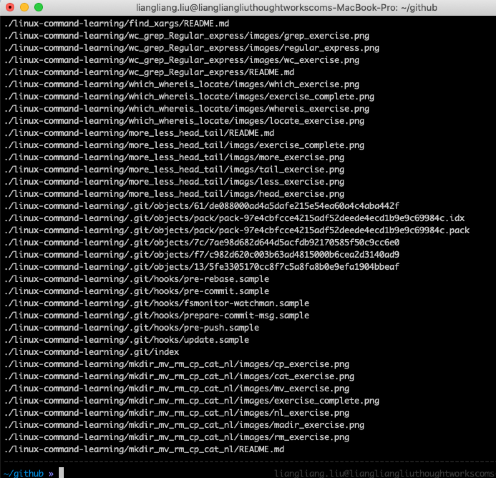
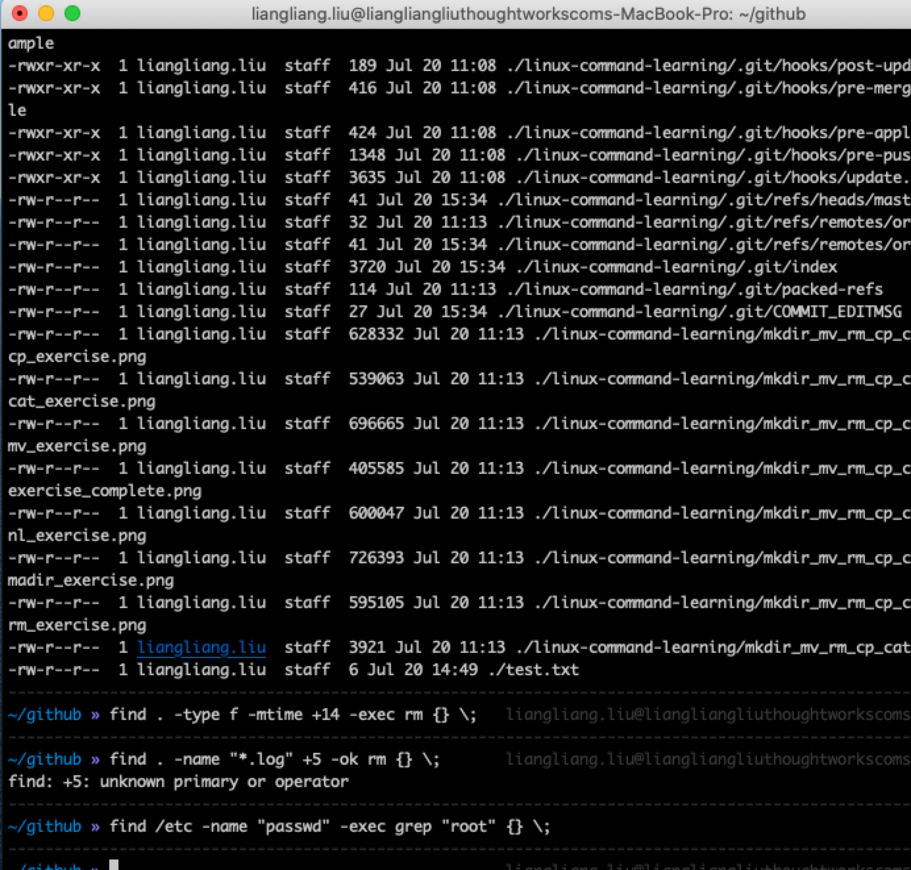
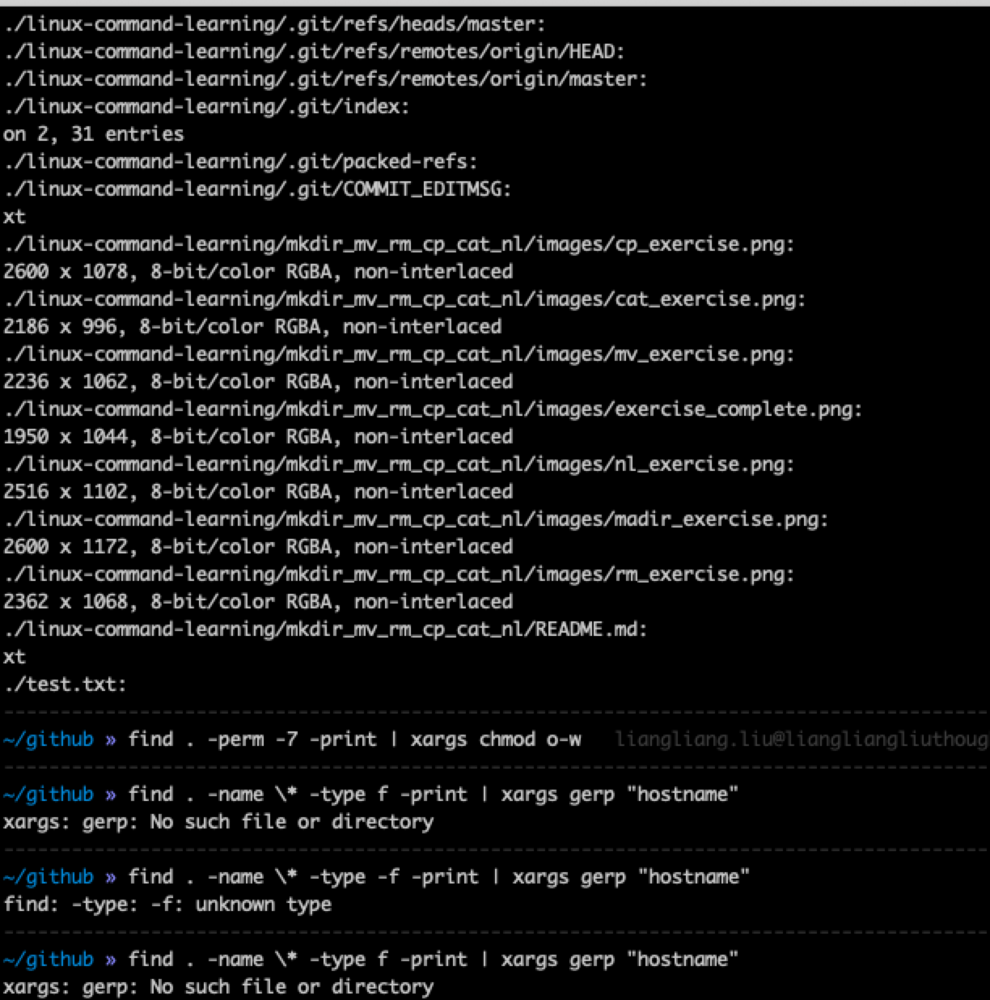

# find & xargs 学习

### find 命令学习
* 用于在文件树中查找文件，并且做处理
* 命令使用
  * ```find pathname -options [-print -exec -ok ...]```
* 命令参数
  * ```-print``` : 经匹配的文件输出到标准输出
  * ```-exec```  : 对匹配的文件做shell命令处理
  * ```-ok```    : 和exec命令作用相同，在执行命令之前会给出显示
* 命令选项
  * ```-name``` : 按照名字查找文件
  * ```-perm``` : 按照权限查找文件
  * ```-mtime``` : 按照更改时间
  * ```-type``` : 按照文件类型
  * ```-nogroup``` : 无效组
  * ```-size``` : 按照文件大小
  * ```时间单位``` : amin(最后N分钟访问的文件)、atime(最后*24小时内的文件)、cmin(最后n分钟改变文件状态)、ctime(最后*24小时改变文件状态)、mmin(最后n分钟改变数据)、mtime(最后*24小时改变文件数据)
* 示例：
  * ```find ~ -atime -2``` : 查询用户目录中两天内修改过的文件
  * ```find ~ -name "*.log"``` :  查找用户目录中以```.log```结尾的文件
  * ```find ~ -perm 777``` : 按照文件的权限来查找文件、
  * ```find ~ -type f -name "*.log"``` : 按照文件类型查找
  * ```find ~ -type d | sort``` :  查找当前所有目录并排序
  * ```find ~ -size +1000c -print``` : 按大小查找文件(查询大于 1000k 的文件)
* 练习
  * 


### find 与exec使用
* 通过exec可以将find查询出来的内容进行命令行操作
  * ```exec cmooand {} \;``` :  exec选项后面跟随着所要执行的命令或脚本，然后是一对儿{ }，一个空格和一个\，最后是一个分号
* 示例：
  * ```find . -type f -exec ls -l {} \;``` : 将ls -l 命令放在 -exec的选项中
  * ```find . -type f -mtime +14 -exec rm {} \;``` : 查找修改时间在N日之前的文件并删除
  * ```find . -name "*.log" +5 -ok rm {} \;```  : 查找以log结尾，在N日之前的文件并删除
  * ```find /etc -name "passwd" -exec grep "root" {} \;``` : 查找passwd的文件，然后查看是否存在一个root用户
  * ```find . -name "*.log" -exec mv {} .. \;``` : 按照条件查询，并移动文件
  * ```find . -name "*.log" -exec cp {} test \;``` : 查找文件，并复制到指定目录
* 练习
  

### find 与 xargs 使用
* 在exec使用时，会出现参数太长，导致移除的错误，xargs 就是解决这个问题。
* 示例；
  * ```find . -type f -print | xargs file ``` : 查找系统中每一个普通文件，通过xargs来测试属于哪类文件
  * ```find / -name "core" -print | xargs echo "" > /tmp/core.log``` : 查找内存信息转储文件(core dump) ,然后保存
  * ```find . -perm -7 -print | xargs chmod o-w``` : 在当前目录下查找所有用户具有刻度、可写权限
  * ```find . -type f -print | xargs grep "hostname" ``` : 使用grep命令在所有普通文件中搜索hostname这个单词
  * ```find . -name \* -type f -print | xargs gerp "hostname"``` : 查找当前目录下的所有普通文件搜索 hostname这个词
  * ```find . -name "*.log" | xargs -i mv {} test``` : 进行mv操作
  * ```find -name "*.log" | xargs -p -i mv {} ..``` : -p参数会提示让你确认是否执行后面的命令,y执行，n不执行
* 练习：
  


