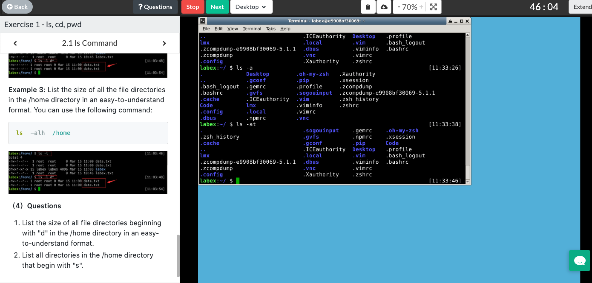

# ls & cd & pwd 学习

### ls [OPTION]
* ls命令用法
  * ```ls``` : 查看当前目录下的内容
  * ```ls -a``` : 查看当前目录下的所有内容
  * ```ls -l``` : 除了文件名之外，列举出文件权限、所有者，文件大小等。
  * ```ls -d``` : 将目录显示为文件
  * ```ls -h``` : 易于理解的格式列出文件大小，eg: 123M、1G
  * ```ls -t``` : 将文件按照时间排序
* ls的命令还可以组合使用
  * ```ls -at``` : 列举出当前目录下的所有内容，并且按照时间排序
* 练习演示
  
