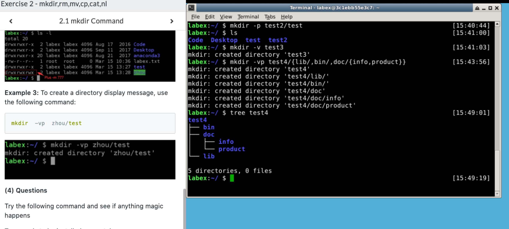

# mkdir & rm & mv & cp & cat & nl 命令学习
 ### mkdir [options] directory
 * mkdir命令
   * ```mkdir directory``` : 创建文件夹
   * ```mkdir -p directory/directory ``` : 可以是一个路径，此时如果路径中的某些目录不存在，加上这个选项后，系统会自动建立好不存在的目录。一次可以创建多级目录。
   * ```mkdir -m 777 directory``` : 创建目录时，给目录设置权限
   * ```mkdir -v directory``` : 每次创建新目录都显示信息
   * ```mkdir -vp scf/{lib/,bin/,doc/{info,product}}}``` : 一个命令创建项目的目录结构 
 * 测试结果  
    
    
### rm [options] file or directory
* 命令用法
  * ```rm -f file or directory``` : 删除文件时忽略不存在的文件
  * ```rm -i file or directory``` : 进行交互式删除
  * ```rm -r/-R file or directory``` : 将参数中列出的全部目录和子目录递归的删除
  * ```rm -v ``` : 删除时显示详细的步骤
* rm操作示例
  * ```rm test.txt``` : 删除test.txt文件
  * ```rm -f test.txt``` : 强制删除test.txt文件
  * ```rm *.txt``` : 删除以.txt结尾的所有文件
  * ```rm -r test``` : 删除test子目录以及子目录中的所有文件，有提示
  * ```rm -rf test``` : 删除test子目录以及子目录中的所有文件，没有提示
  * ```rm -- -t``` : 删除以-t开头的文件
* 练习示例
        
