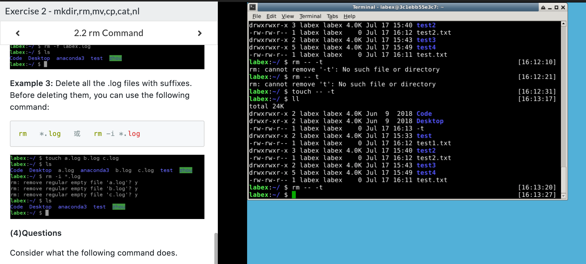

# mkdir & rm & mv & cp & cat & nl 命令学习
 ### mkdir [options] directory
 * mkdir命令
   * ```mkdir directory``` : 创建文件夹
   * ```mkdir -p directory/directory ``` : 可以是一个路径，此时如果路径中的某些目录不存在，加上这个选项后，系统会自动建立好不存在的目录。一次可以创建多级目录。
   * ```mkdir -m 777 directory``` : 创建目录时，给目录设置权限
   * ```mkdir -v directory``` : 每次创建新目录都显示信息
   * ```mkdir -vp scf/{lib/,bin/,doc/{info,product}}}``` : 一个命令创建项目的目录结构 
 * 测试结果  
    

### rm [options] file or directory
* 命令用法
  * ```rm -f file or directory``` : 删除文件时忽略不存在的文件
  * ```rm -i file or directory``` : 进行交互式删除
  * ```rm -r/-R file or directory``` : 将参数中列出的全部目录和子目录递归的删除
  * ```rm -v ``` : 删除时显示详细的步骤
* rm操作示例
  * ```rm test.txt``` : 删除test.txt文件
  * ```rm -f test.txt``` : 强制删除test.txt文件
  * ```rm *.txt``` : 删除以.txt结尾的所有文件
  * ```rm -r test``` : 删除test子目录以及子目录中的所有文件，有提示
  * ```rm -rf test``` : 删除test子目录以及子目录中的所有文件，没有提示
  * ```rm -- -t``` : 删除以-t开头的文件
* 练习示例
        

### mv [options] source file or directory  target file or directory
* 命令用法
  * ```mv test.txt test.log``` : 移动文件，文件名也会被替换
  * ```mv test.txt test/ ```   : 将文件移动套test目录下
  * ```mv  test.txt -b test.log```: 文件被覆盖前做备份
  * ```mv t1.txt,t2.txt,t3.txt test/``` 等同于 ```mv -t test/ t1.txt,t2.txt,t3.txt```将多个文件移动到一个文件中
  * ```mv -i test.txt test.log``` : 如果test.log存在，询问是否需要覆盖掉文件
  * ```mv -f test.txt test.log``` : 强制覆盖文件 
  * ```mv test1/ test2/ ``` : 文件目录移动
* 练习
    

### cp command
* 命令格式
  * ```cp [options] source file directory``` 
  * ```cp [options] -t directory source files```
* 命令用法
  * ```cp test.txt test``` : 复制单个文件到目标目录中，如果文件不存在，直接复制，如果文件存在，会询问是否要覆盖掉文件。
  * ```cp -a test test01``` : 复制整个目录，如果文件存在时，整个源目录会被复制到目标目录中。
  * ```cp -s test.txt test_link.txt``` : 复制文件建立一个连结文档
* cp练习
    

### cat command
* 命令用法
  * cat 三大功能
    * 一次显示整个文件 ```cat filename```
    * 从键盘创建一个文件```cat > filename``` 只能创建文件不能编辑已有文件
    * 将几个文件合并为一个文件```cat file1 file2 > file``` 
* 使用示例
  * ```cat -n test1.txt test2.txt``` : 将test1文件中的内容加上行号，输入到test2中。
  * ```cat -b test1.txt test2.txt``` : 将test1文件中的内容加上行号，空白行不加，输入到test2中。
  * ```cat -n test1.txt test2.txt test.txt``` : test1和test2加上行号，合并到test中
  * ```cat >test.txt <<EOF``` : 给文件添加内容，遇到EOF，添加结束
  * ```tac test.txt``` : 反向显示文件内的内容
* 练习
    

### nl command
* 命令用法
  * 用来计算文件行号
  * ```nl [options] file```
* 使用示例
  * ```nl test.txt``` : 列出文件的内容,空白行不会加行号
  * ```nl test.txt``` : 列出文件的内容,空白行会加行号
  * ```nl -n rz -w 3 test.txt``` : 行号补齐三位数，不够添加0输出
* 练习
  

### 练习完成
