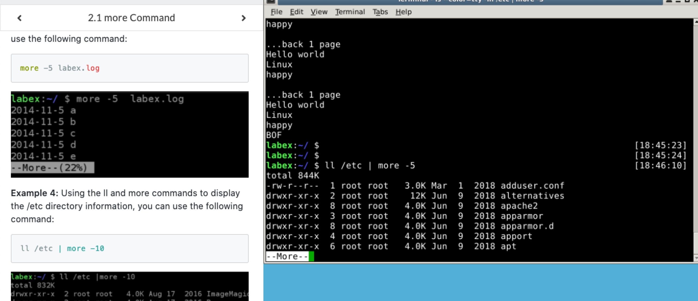
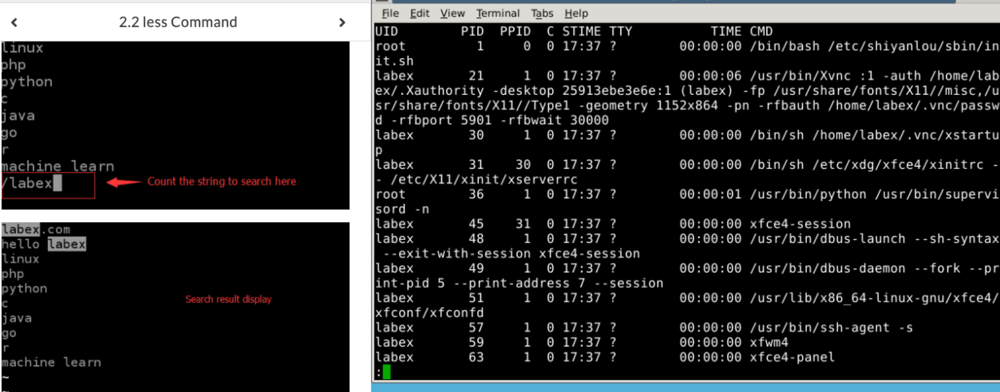
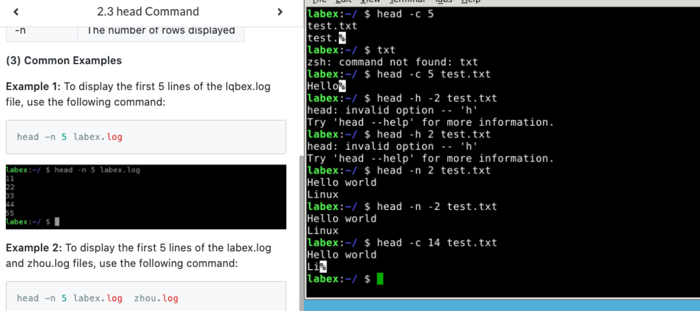

# more & less & head & tail 学习
### more command
* 命令用法
  * more [oprion] file
* 示例：
  * ```more +3 test.txt``` : 从第三行开始显示内容
  * ```more +/hello test.txt``` : 查找文件中hello的地方，从这里输出
  * ```more -5 test.txt``` : 设置每页五行显示问价
  * ```ls /etc | more -10``` : 配合管道显示内页的行数 
* 练习
    

### less command
* less命令可以让文件的内容向前，向后切换
* 示例：
  * ```less test.txt``` : 查看文件
  * ```ps -ef | less``` : ps查看进程信息通过less分页显示
  * ```history | less``` : 分页查询历史命令
  * ```less test.txt test.log``` : 同时浏览多个文件
* 练习
  

### head command
* 用来显示档案的开头至标准输出
* 命令用法
  * ```head [oprion] [file]```
* 示例
  * ```head -n 5 test.txt``` : 显示文件的前5行
  * ```head -c 20 test.txt``` :  显示文件的前20个字节
  * ```head -c -20 test.txt``` :  显示文件除了最后20个字节的内容
  * ```head -n -5 test.txt``` :  显示除了最后 5行的内容
* 练习
    


