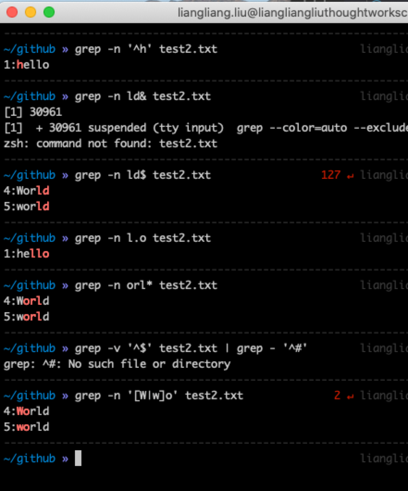

# wc & grep & Regular expressions 命令学习
### wc命令
* WC(Word count)用来统计指定文件中的字节数、字数、行数，并显示
  * ```WC [options] file
* 参数说明
  * ```-c``` : 统计字节数
  * ```-l``` : 统计行数
  * ```-m``` : 统计字符数
  * ```-w``` : 统计字数
  * ```-L``` : 打印最长行的长度
  * ```-help``` : 打印帮助纤细
  * ``` --version``` : 显示版本
* 示例
  * ```ls -l | wc -l``` : 使用管道符统计当前目录下的文件数
* 练习
    


### grep命令
* 文本搜索工具，它能使用正则表达式搜索文本，Global Regular Express Print(全局表达式版本)
* 命令格式：
  * ```grep [option] pattern file``` 
* 示例：
  * ```ps -ef | grep git``` : 查找指定进程
  * ```ps -ef | grep git -c``` : 查找指定进程个数
  * ```cat test.txt | grep -f test2.txt``` : 从文件中读取关键词进行搜索
  * ```cat test.txt | grep -f test2.txt``` : 从文件中读取关键词进行搜索，显示行号
  * ```cat "hello" test.txt``` : 从文件中查找关键词
  * ```cat test.txt | grep ^h``` : 找出以 h 开头的内容
  * ```cat test2.txt | grep ^[^h]``` : 输出 非h 开头的内容
  * ```cat test2.txt | grep ld$``` : 输出以 ld 结尾的内容
  * ```cat test2.txt | grep -E "e|ux"``` : 输出包含 e/ux的内容
  * ```grep '[a-z]\{4\}' *.txt``` : 输出下列文件中知道4个连续小写的字符串行
* 练习
    

### Regular expressions (正则表达式)
|   字符     | 意义           |
|   :----:  |      :----     |
|  ^word    | 以word开头的内容 | 
|   word$   | 以word结尾的内容   |
|   .	    | 代表一定有，一个任意字符  |
|   \	    | 转义符，脱字符，将特殊符号转为为普通字符| 
|   *       | 重复0或者N个正则字符      |
|   [list]  | a[abc] 表示：可能为 aa,ab,ac  |
|   [n-m]   | -表示 一个连续范围之间，与ASCII编码有关。|
|   [^list] | ^为反向选择，表示不选[]中的内容          |

* 示例：
  * ```grep -n '^h' test2.txt``` : 必须以 h 开头
  * ```grep -n ld$ test2.txt```  : 以 ld 结尾
  * ```grep -n l.o test2.txt```  : l和o之间任意字符
  * ```grep -n orl* test2.txt``` : or后面l相关的内容
  * ```grep -n '[W|w]o' test2.txt``` : wo 或者 Wo的组合
* 练习
    
