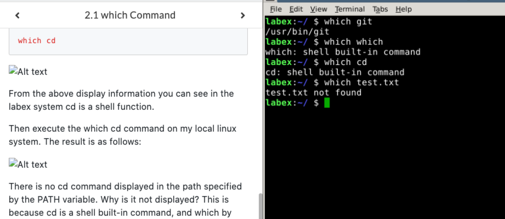
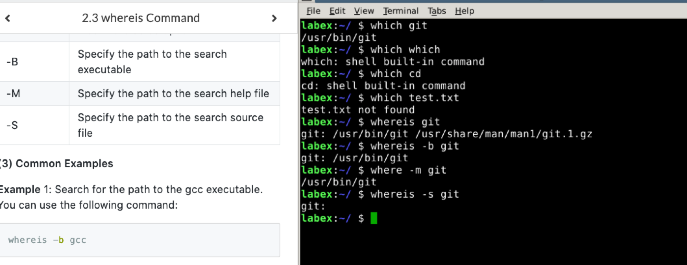

# which & whereis & locate 命令学习

### which 命令
* 用来查找文件
* 用法
  * ```which executable file name``` 
* 示例: 
  * ```which git``` : 查找文件，显示命令路径
* 练习
    

### whereis 命令
* 只能用于程序名搜索，只能是二进制文件
* 用法
  * ```whereis [option] file``` 
* 示例: 
  * ```whereis git``` : 将文件相关的都查询出来
  * ```whereis -b git``` : 只查询二进制文件
* 练习
    

